# Tribology Course Project

# Note from the Author

This was a really fun project I did for a graduate level tribology course. While simple in nature, investigating the tribological performance of a galaxy fan bearing, the project was a favorite of mine because I spent a lot of time coding, and some analytical modeling.


author: Isaac W. Sluder
date: April 14, 2025\
Course: MECE 486/696\
Professor: Dr. DellaCorte

# Graduate Tribology Project - The Tribological Behavior of a Galaxy Box Fan

# Introduction

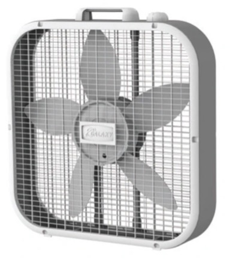

This project investigates the tribological behavior of the bearings in a
Galaxy Box Fan and aims to quantify the energy lost due to them. To
achieve this, we will measure the fan's total power consumption,
electrical input power, and motor output power. The expected energy
balance can be expressed as:

$$P_{\text{electrical}} = P_{\text{motor}} + P_{\text{bearings}} + P_{\text{air}}$$

From this, we should be able to infer the power consumed by the bearings
by determining the motor and air power. Air power depends on multiple
factors, including blade speed, number of blades, blade geometry, air
density, angle of attack, and aerodynamic losses such as drag and
turbulence. Electric motor efficiency typically ranges from 85% to 95%,
depending on factors such as winding architecture, current, core
materials, cooling mechanisms, and losses due to resistance, magnetism,
and mechanical friction from the bearings---which is ultimately our
goal. Using our working knowledge of mechanical engineering concepts and
the added benefit of learning tribology, this work aims to understand
and calculate the efficiency and energy loss associated with the
bearings in the motor.

To analyze this behavior, we will use an indirect dynamic modeling
approach to estimate the friction in the bearings. The bearings in the
fan must provide minimal friction during operation to avoid wasted
energy caused by wear, deceleration, and asperity contact. However, when
the fan is turned off, these mechanisms gradually slow the fan blades
until the motor stops. The torque on the fan blades when no power is
applied can be modeled as:

$$T_{total} = T_{friction} + T_{air} + T_{back\, EMF}$$

The torque due to back emf will be neglected because we believe this
effect to be minimal (and it is out of the scope of this project). So
the general method for calculating the torque induced due to friction
should be as easy as:

$$T_{friction} = T_{total} - T_{air}$$

The main approach we will utilize for calculating torque will be
coast-down tests. The method for a coast-down test is to measure the
amount of time it takes for the motor and structure to stop moving after
power is turned off. Typically, the acceleration and deceleration in the
bearings are non-linear (due to many factors not discussed here),
however for the purpose of simplicity, the time it takes for the
structure to stop moving can be used to estimate the deceleration by
using linear equations: $$\omega_f = \omega_0 + \alpha t$$ Where
$\omega_f$ is the final velocity (in our case its 0), $\omega_0$ is the
initial velocity, and $t$ is the time. The equation can be re-written as
to get the angular acceleration:
$$\alpha = \frac{\omega_f - \omega_0}{t}$$ This assumes the acceleration
is linear, which is unlikely to be the most accurate method but for our
purposes will be sufficient. The torque can then be back-calculated from
Newton's rotational equation of motion: $$T = - I \alpha$$ Where I is
the moment of Inertia. To infer the Torque due to friction, the coast
down tests will need to give us two times: $t_{total}$ and
$t_{no\, air}$. This means two test must be run. One with the fan blades
(this gives us total) and one with a disk with approximately the same
amount moment of inertia (which gives us no air). Lastly, for fun, the
friction can be estimated from the general equation for friction with
$t_{no\, air}$: $$F = N \cdot f_f$$ Where we can substitute with
rotational terms: $$T_f = f_v \cdot W \cdot R$$ Which leads to:
$$f_v = \frac{T_f}{W \cdot R}$$ Once both Torque terms are calculated,
$T_{f,\,total}$ and $T_{f,\,no\, air}$, the power of each can be
calculated through: $$P = T \cdot \omega$$ These equations will allow
estimations of how much power the bearings are consuming during
operation.

This report begins with **Background** section with information on the
Galaxy Box Fan, including a teardown to obtain key parameters such as
mass, geometry, and electrical power consumption.

The **Methods** section outlines three experiments designed to provide
the necessary data for torque and power calculations; Velocity
Calculation Method, Design and Manufacturing of a Disk, and Coast-Down
Testing

In the **Results** section, experimentally determined bearing friction
and power losses are compared with theoretical predictions based on
bearing geometry and classical tribological models in five sections;
Speed Calculation Results, Simulating Bearing Friction using Sommerfeld
relations, Simulating Bearing Friction using Couette Flow Torque, Coast
Down Results, and Graphical Coast-Down Calculations. Then a short
**Conclusion** to recap the study.

An **Appendix** is included to detail the software tools and scripts
used in the computer vision analysis of slow-motion video data and
others.

# Background

## Galaxy Fan Origin and Information

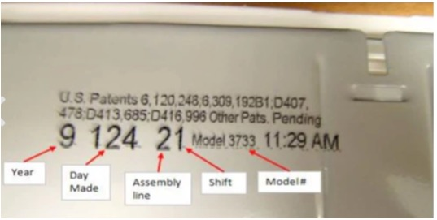

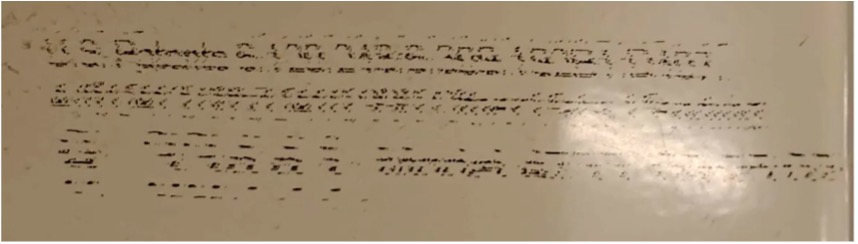

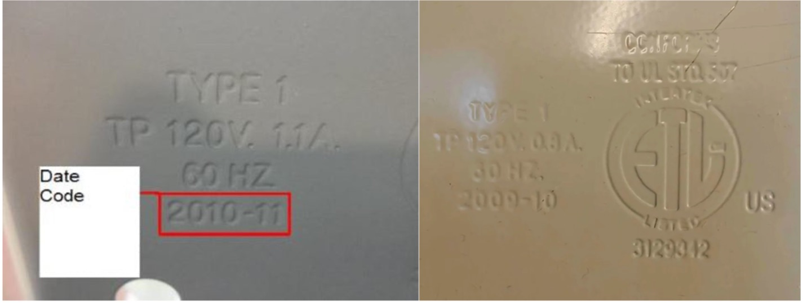

The Galaxy box fan provided is a 20-inch fan produced by a company known
as Lasko. Lasko is a company (Lasko Products, LLC ©2025) with corporate
office in West Chester, PA and manufacturing plants in Fort Worth, TX
and Franklin, TN. The galaxy features 3 speeds with top mounted controls
and Lasko claims that the fan costs less than two cents per hour to run.
Lasko products seems to run under several names and has recently (within
10-20 years) switched from selling the box fan under the name of Galaxy
Fans to Lasko Fans which is now commonly sold at Walmart, Home Depot and
Target (and more).

From the website
([LINK](https://lasko.com/products/lasko-20-galaxy-box-fan-with-3-speeds-b20100-white?utm_source=chatgpt.com)),
Lasko give us some important information we can glean from our fan.
First, the box fan has information stamped and printed on it. The
website shows how to de-code some of this information (which is very
rare for companies to do). Our printed information is however very
difficult to read and looks to have been smeared beyond recognition. The
second piece of information comes from the stamped coding which also
comes from the website. It tells us the electrical voltage and current
the fan is supposedly consuming, the frequency, and a date for the fan.
Our fan appears to consume 96 Watts of power, while the fan on the
website has a higher power consumption rate of 132 Watts. This leads to
a suspicion there may be several models available, or models made for
different countries.

      Model/SKU                 B20100             
  ----------------- ------------------------------ --
       Weight                  9.8 lbs             
     Dimensions      22.56 in x 21.5 in x 4.44 in  
      Material                 Quantity            
       Plastic                 28.39 %             
        Steel                  58.22 %             
       Copper                   5.79 %             
      Aluminum                  4.37 %             
   Wire Insulation              3.23 %             

  : Product Specs Table

Our fan also appears to have been manufactured (if the date refers to
manufactured date) in October 2009 whilst the online model was made in
November 2010. Thus, it seems that our current model may be a mystery
and most of the information will have to be acquired by physical
investigation of the product. The website also provides some information
about the physical aspects of the product including the materials it was
made of. This is shown in Table [1](#tab:table1).

## Teardown of the Fan

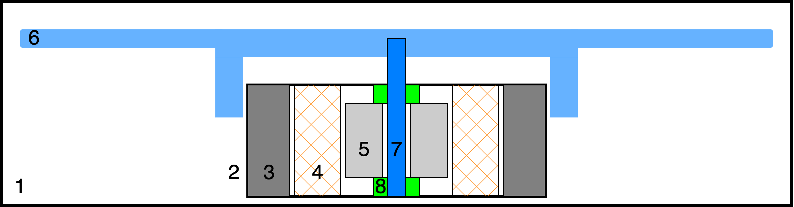

A basic schematic of the fan is shown in Figure
[1](#fig:schematic). The
figure shows the major components contributing to the structural,
electrical/mechanical, and tribological systems. First, the structural
components are (1) the frame of the box fan (which includes front and
back grill and metallic outside frame), (2) represents the plastic
housing for the motor, and (3) is the metallic casing protecting and
holding the internals of the motor. The electrical/mechanical components
include (4) the coils and (5) the rotor. The fan (6) is support
mechanically and tribologically through (7) the main shaft and (8) the
journal bearings.

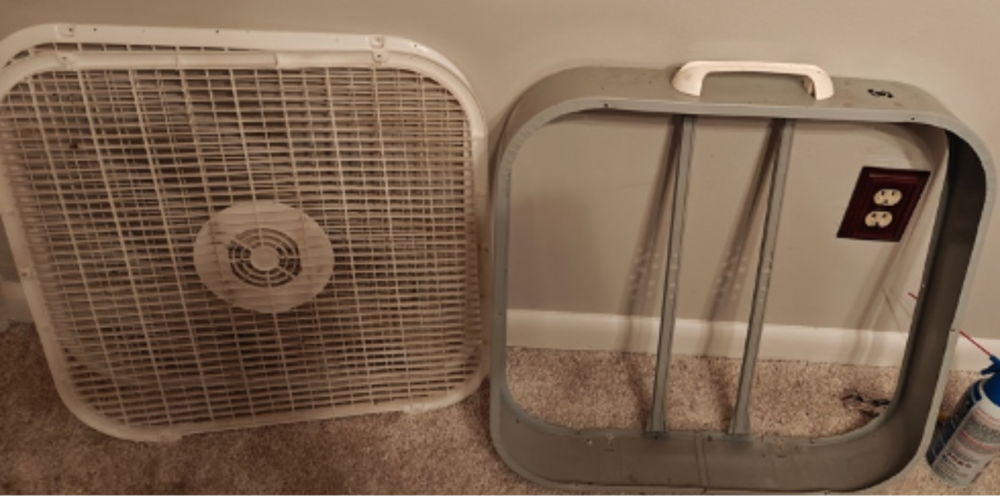

In figure [2](#fig:sframe),
the frame and front/back grills can be seen separated. This is part 1 in
Figure [1](#fig:schematic).

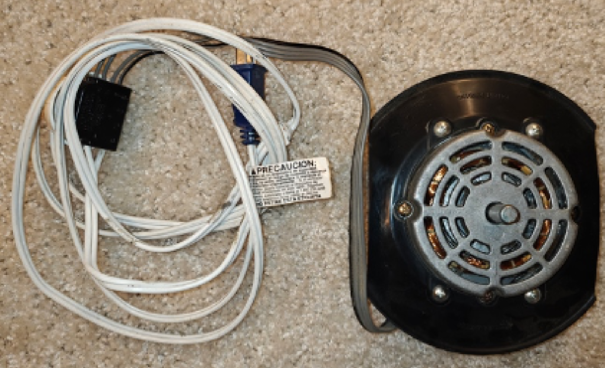

Figure [3](#fig:motormount) shows motor attachment method--a plastic
fixture to hold the motor and fan to the frame. This is part 2 in the
Figure [1](#fig:schematic).

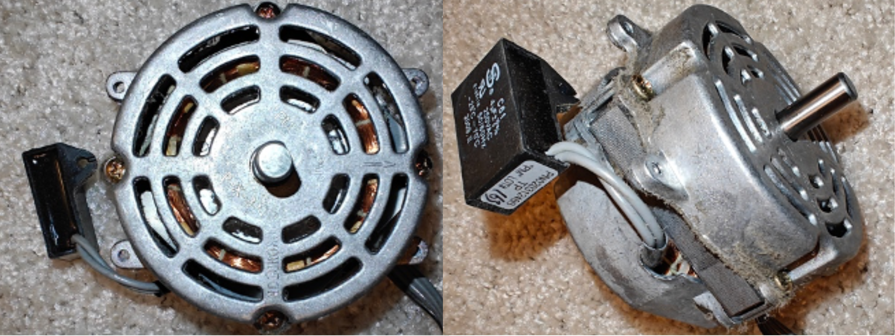

Figure [4](#fig:motorshell) depicts two sides of the motor shell (part 3
in [1](#fig:schematic))
that hold and protect the internals of the motors. A motor start
capacitor is viewed on the side, which may contribute to the speed
controls of the appliance (and help the motor get up to speed).

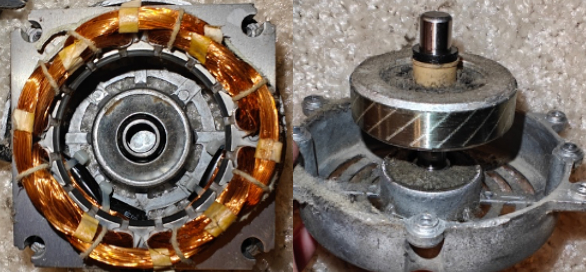

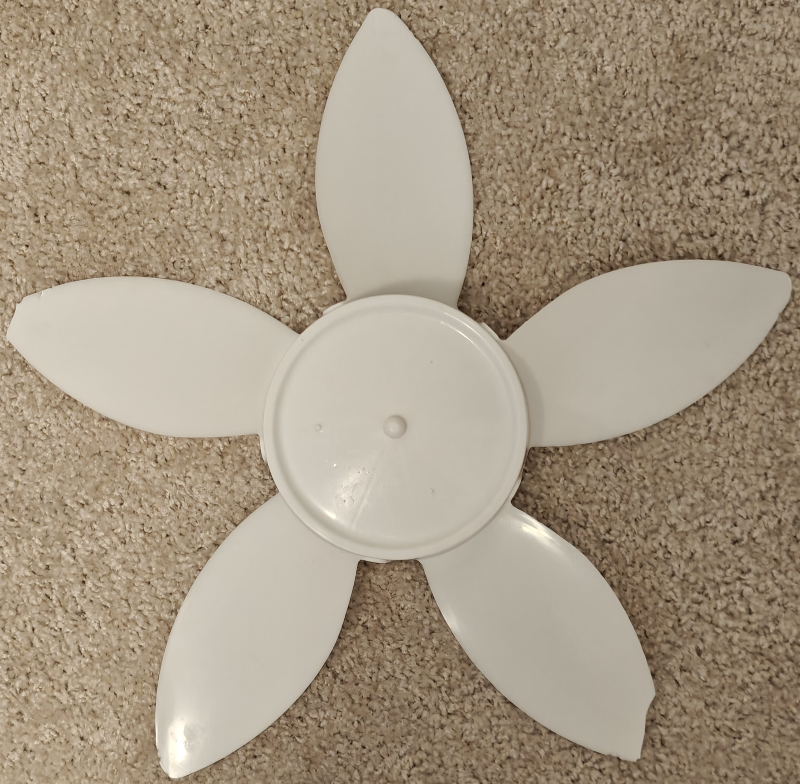

The rotor (right) and coils (left) are in view in Figure
[5](#fig:rotorcoils)
which provide power and rotation to the fan blades. These are part 4 and
5 on Figure [1](#fig:schematic) which transmit motion to the shaft and fan
blades. A colleague revealed that the since the fan runs at 1025 rpm
(later revealed in the report
[4.4](#sect:coast-down-results)), that this was likely a 6 pole
motor--this was not verified. Part 7 the shaft is also in view, and is
the tribological surface that contacts with the journal bearings. It may
be helpful to know that the shaft and rotor together weigh about
$178\, g$. The fan blades can also be seen which are driven by the shaft
in Figure [6](#fig:fanblades). An important feature of the fan blades is
the mass of the blades and its diameter. This will help with modeling
the moment of inertia of the blades later on. The mass of the fan blades
is $m = 178.13\, g$. It's common for manufactures to balance the mass of
the fan blades with the mass of the shaft. This helps with vibrations
and ensuring smooth operation. The diameter of the fan blades is
$d = 50.8\, cm$. This diameter will also be useful in calculating the
moment of inertia and other dynamic properties of the fan system.

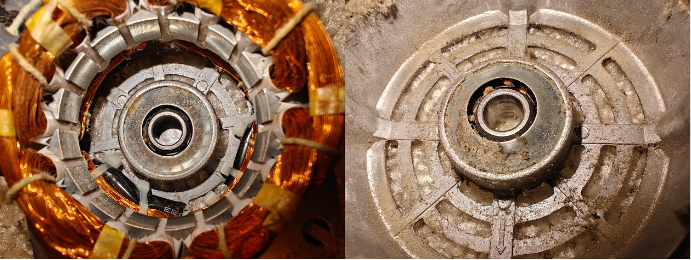

Lastly the journal bearings are the final tribological contact. The
bearings support the shaft while permitting motion for the fan blades.
The journal bearings are in Figure
[7](#fig:journalbs), and
are represented by the green area in the schematic, Figure
[1](#fig:schematic), as
part 8. There is some important geometry that can be gathered from the
journal bearings that can help predict the performance of the
lubrication and friction. The inner diameter of the bearing and the
diameter of the shaft can be used for predicting performance later on.
The inner diameter is $D_i = 9.60\,mm$ and the diameter of the shaft is
$D_s = 9.54\,mm$. This gives us about clearance of about $c = 0.06\,mm$.

# Methods

## Velocity Calculation Method 

r3in 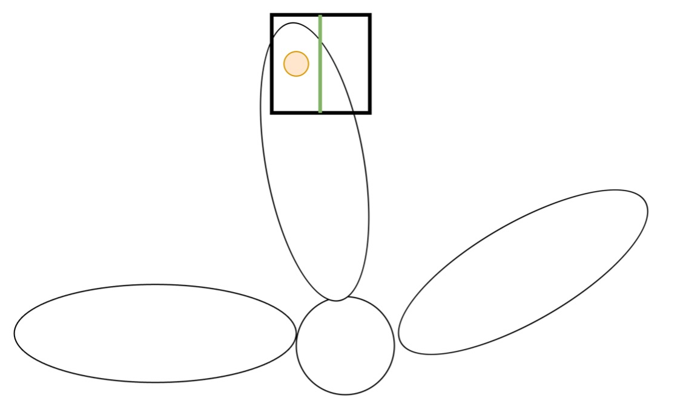

Calculating the speed of a fan is not so direct, but there are many ways
to go about it. Fan speed in RPM can be measured using a tachometer
(contact or non-contact), a stroboscope, a Hall effect sensor, an
optical sensor, sound frequency analysis, electrical methods (AC/DC
motor equations), video analysis, or an Arduino/microcontroller-based
system. We will attempt to measure the fan speed with video analysis.
The following method is a simple way to measure the speed of the fan
using a video camera and a computer.

In Figure [\[fig:camera frame\]](#fig:camera frame), half of the fan is in view. An orange dot
has been placed on the fan blades to indicate the section we will be
measuring. The box is the viewing angle of the camera with the green
line signifying the center position. The goal is this, record slow
motion video of the fan through several phases, start up, constant
speed, and slow down each at the different fan speed options. Every time
the orange dot passes the center of the camera's vision; an event should
be recorded. This should give us accurate measurements of the speed of
the blades.

We set up our experiment to utilize a slow-motion camera on a OnePlus 12
Android phone capable of recording slow-motion video at 480 fps (frames
per second) at 720p resolution. This should be fast enough for our set
up as a quick google search revealed \[source needed here\] that a
common box fan should not exceed the speeds of 1250 rpm. According to
the Nyquist frequency sampling theorem, the sampling device must be
capable of recording twice that of the aimed frequency. So,

$$f=\frac{60*FPS}{2}=\frac{60*480 \text{ fps}}{2}=14,400 \text{ rpm}$$

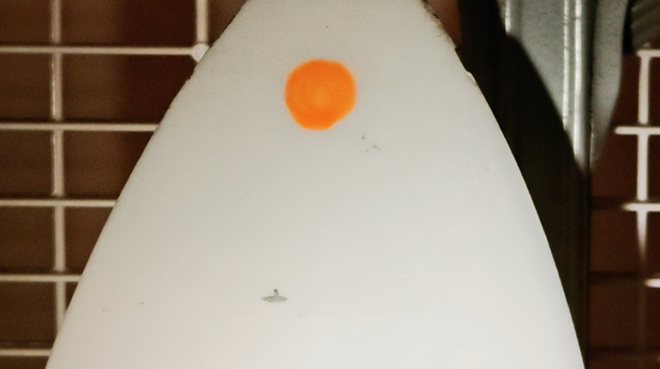

Therefore the phone should be able to very capable capture the speeds of
1250 rpm.

The video was recorded with each of the phases (start up, constant, slow
down) at all 3 motor speeds (Max, Mid, and Low) in mind though more
experiments may be needed to repeat in the future to validate the
results. With slow-mot ion enabled the video is about 16 minutes long
though recording only took about a minute and the video has around
28,000 frames. Combing through the video by hand is very annoying at the
very least and would take weeks. Python's computer vision library called
OpenCV will be utilized to analyze the videos. The first frame from the
video is shown in figure
[\[fig:first frame\]](#fig:first frame):

However, a computer analyzing 28,000 of these clips would also take a
long time therefore the video was cropped to only include the region of
interest as shown in the next figure. The next goal is deciding on how
to detect whether the blade in question is in frame. This is why the
orange dot was chosen as there are no other orange items in the vicinity
of the frame and an orange Sharpe was available for use. As you see in
Figure [\[fig:first frame\]](#fig:first frame), the orange dot has a large dynamic range
of oranges, thus we must set color limits so the computer can detect
whether these colors are in frame or not. The upper and lower limits of
orange are depicted in Figure
[\[fig:cropped\]](#fig:cropped).


After the color limits have been chosen, a mask is applied to the frame
in question with the color limits
([9](#fig:colorpalette)). The mask results in a black and white
array that represent whether the chosen individual pixel is in the color
range. This result can be seen in Figure
([\[fig:mask on dot\]](#fig:mask on dot)).

However, this only gets us so far. As this specific frame is the first
frame in the video and the orange spot will not look like this while
spinning at 1250 rpms. The challenge comes in tuning the color spectrum
and the amount of orange seen in each frame. See Figure
([\[fig:mask on dot moving\]](#fig:mask on dot moving)) for a visual of the orange dot in
motion.

The result of tuning is a much higher orange color limit. Another
challenge is that as one increases the color limit, it allows more
orange-white into the mask then previously allowed. This means that
other objects may start to appear in our mask see Figure
([12](#fig:background mask)).

To combat this a simple method was applied to calculate whether the
orange dot was in view or not. Take the mask and add it up to get a
percentage of orange in view. We call this our orange concentration
number. If the orange concentration in the frame exceeds a certain
value, the orange dot is in view and a timestamp can be recorded. The
algorithm for deciding this is shown in the python script in the
appendix. The results for these calculations can be viewed in the
[results and discussion section](#sect:results).

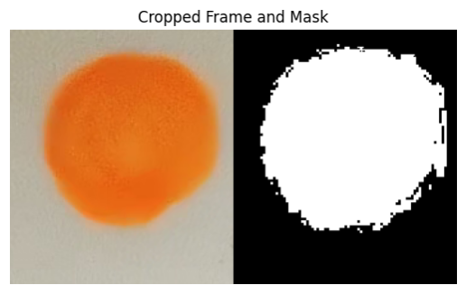

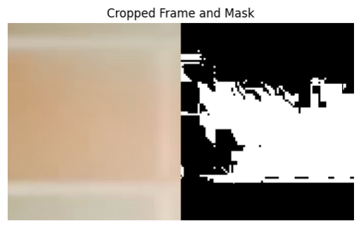

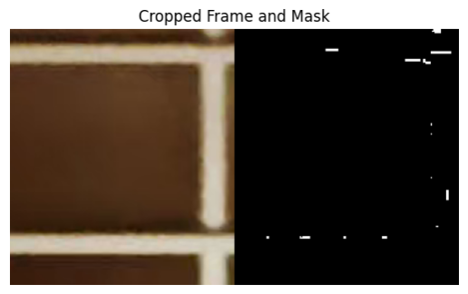

## Design and Manufacturing of a Disk

### Calculating MOI

The moment of inertia (MOI) is a parameter that will allow us to find
geometry to test on the fan that will retain the same inertia as the fan
blades but lack other features that may allow us to interpret the
friction and/or friction force on the bearings. To calculate the moment
of Inertia there are a few necessary parameters that need to be easily
gathered. First the diameter of the blades is 20 in or 0.508 m. Then the
mass was measured to be 0.1781 kg. The fan will be simplified to a thin
disk which has the equation of: $$I = \frac{m r^2}{2}$$ where m is the
mass, and r is the radius of the disk. Plugging in our values we get:
$$I = \frac{m r^2}{2} = \frac{0.1781 * \text{kg} * 0.254^2 \text{m}^2}{2} = 0.00574515 \text{kg}*\text{m}^2$$

The disk will be modeled using this MOI but much smaller in diameter as
to negate rotational forces and friction due to air. For this to work
the disk must adhere to the same mass and density of the fan blade. This
can be estimated using geometry and a fixed density. This was done in
python:

``` {.python language="Python" caption="Converting Units"}
m = 178.1 / 1000      # kg
D = 20 * 25.4 / 1000 # m
r = D / 2     # m
rho = 0.9 * 1000    # kg/m^3

print("m = %.4f kg" % m)
print("D = %.4f m" % D)
print("r = %.4f m" % r)
print("rho = %.4f kg/m^3" % rho)
```

Where the printouts are:

    m = 0.1781 kg
    D = 0.5080 m
    r = 0.2540 m
    rho = 900.0000 kg/m^3

And manipulating volumetric equations we can verify the mass and
calculate the required thickness to match our fan:

$$\begin{aligned}
    V &= t * A \\
    V &= m / \rho \\
    t * A &= m / \rho \\
    t &= \frac{m}{\rho * A}\end{aligned}$$

Plugging this back into python we get:

``` {.python language="Python" caption="Finding Thickness and Verifying Mass"}
from math import *
    A = pi * r**2
    t = m / (rho * A)
    V = A * t
    print("A = %.4f m^2" % A)
    print("t = %.4f m" % t)
    print("V = %.4f m^3" % V)
    print("Verify... ")
    m = rho * V
    print("m = %.4f kg" % m)
```

Where the outputs are:

        A = 0.2027 m^2
        t = 0.0010 m
        V = 0.0002 m^3
        Verify... 
        m = 0.1781 kg

Therefore, our model disk has a diameter of 0.5080 m and a thickness of
0.0010 m, with a MOI of 0.005745 $kg*m^2$.

### Design of Disk

Traditional coast-down tests will design a disk of similar size, mass,
and moment of inertia as the fan blades themselves. This gives a rough
depiction of how the fan would operate without air slowing it down.
Which in return would show us the friction in the bearings. However, due
to time and resources our manufacturing methods limit us in the fact
that at this time we were unable to produce a disk of the same size as
the fan blades. Thus, we decided for our purposes that designing a disk
of similar moment of inertia would be sufficient for our project.

To get a disk of similar moment of inertia, but smaller diameter is a
balancing act of decreasing the radius while rapidly increasing the
mass. Initially, a disk of about $120\, mm$ and $624\,g$ in conjunction
with eight $30\,g$ weights was attempted to be printed. This turned out
to not be efficient and a waste of plastic.

A second attempt was done with four heavier weights each weighing about
$309\,g$ and radius $20.6\,mm$. This amount of mass is a little too much
for a disk model, so a pendulum model was developed to achieve the same
goal. Picture a pendulum on a string. The moment of inertia of a
pendulum on a string can be calculated by adding the moment of inertia
of the disk, and the parallel axis theorem to get:
$$I = \frac{M \cdot r^2}{2} + M \cdot l^2$$

Where, $M$ is the mass of the weight, $r$ is its radius, and $l$ is the
distance from the center. To model 4 separated by 90 degrees, all we
need to do is multiply it by 4.
$$I = 4\left(\frac{M \cdot r^2}{2} + M \cdot l^2\right)$$


Since we know the moment of inertia of our fan we are matching and the
mass and the radius of the weights, all that is needed to solve for is
the length of our \"string\" for our model (see figure
[13](#fig:pmoi) for
depiction). The derived equation for that is:
$$l = \sqrt{\frac{I}{4 M}-\frac{r^2}{2}}$$ Plugging in our values:
$$l = \sqrt{\frac{0.005745 kg \cdot m^2}{4 \cdot 0.309\,kg}-\frac{0.0206^2\,m^2}{2}} = 0.06659556 m$$
Getting us a length of about 66.60 mm. This yielded us a design that
looks like this in CAD:

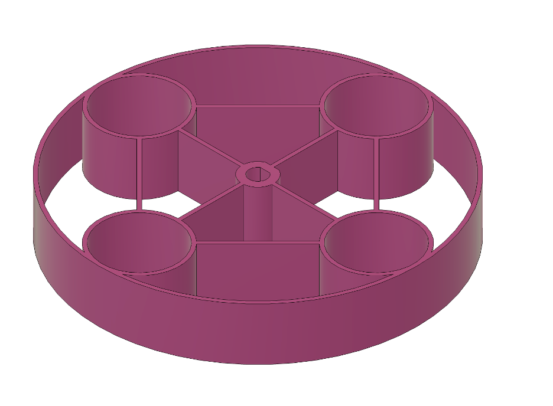

The result is a frame for the weights that imitates the moment of
inertia for our fan blades. There is some error to this approach. In the
figure [15](#fig:f360pmoi3d) below, Fusion 360 outputs the moment of
inertia assuming the correct materials are selected.


Taking the $I_{zz}$ from the drawing we can compare that to the moment
of inertia our fan-disk model has: $$I_{zz} = 6291000\, g \cdot mm^2$$
$$I_{fan-disk} = 5745149.0\, g \cdot mm^2$$
$$error = \frac{I_{zz} - I_{fan/disk}}{I_{fan/disk}} = 0.095$$ So there
is a little error with our model, but this won't affect the results
since our power calculations will use each respective moment of inertia.
This means that while the model is not a perfect representation of the
fan blades, it is close enough for our purposes. The error of
approximately 9.5% is acceptable given the constraints of our project
and the precision required for our calculations. Future iterations of
this model could aim to reduce this error further by refining the design
or using more precise manufacturing techniques.


## Coast-Down Testing 

The coast down section is designed in such a way as to make calculating
acceleration (decay rate or \"coast-down\") easy and efficiently. The
disk was 3D printed as designed as shown in the previous section.
Coast-down tests were performed for both the fan blades and the
manufactured (inertia matched) disk. Doing coast down tests with the fan
blades was easily done with no amount of difficulty. However, the
spinning disk required the front grill be removed to the fact the
thickness of the disk was larger than allowed. This raised some safety
concerns, which were resolved using a pillow fort and a cardboard box.

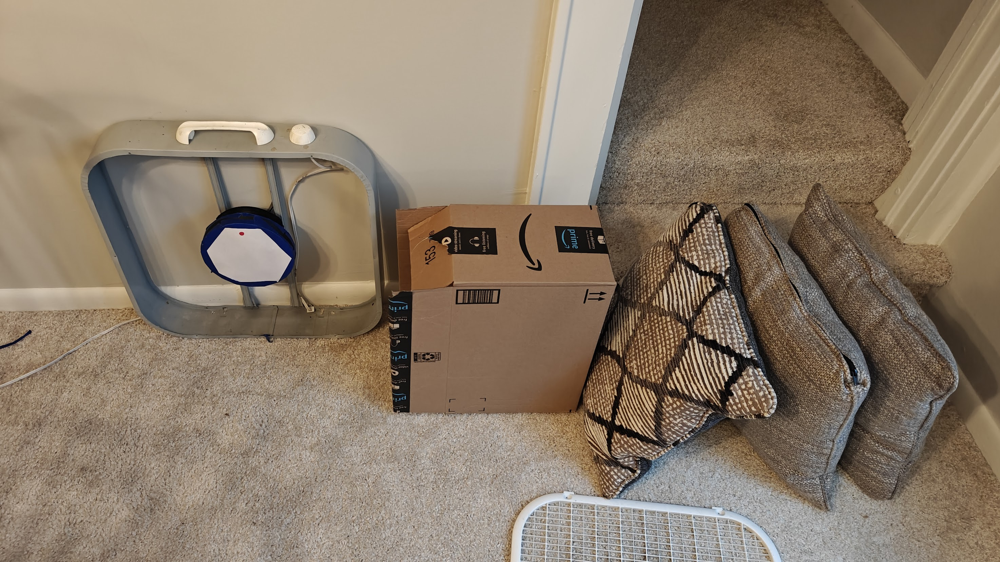

There was also some concern whether the front of and back of the
spinning disk ([16](#fig:final_model)) should be covered as the open holes could
create some unintended drag. Recordings of the sounds from the disk were
analyzed (by FFT) to see if any differences were detected, this is
viewed in figure [18](#fig:airsounds). The first circled area in the top row points
towards lower frequency noises caused by drag. They are clearly
different from the sounds that the disk makes. The second circled
section shows higher frequencies caused by drag on the holes. When the
front and back were covered the drag was negated.


The main procedure for collecting coast down times is listed here:

-   Turn on motor

-   Let motor reach steady-state operation

-   Turn off motor

-   Immediately start recording on a stopwatch

-   Stop the timer when the motor stops rotating and record

-   Repeat for each speed

There is some error to this method, and its due to the fact that data
points during the coast-down cannot be taken by hand (its expected this
would reveal a semi-logrithmic curve). There are methods for gathering
data points such as the previous method for calculating velocity, but
that method may not always be reliable as it depends on the slow-motion
camera being consistent and the speed of the disk not to rotate fast
enough for the Nyquist frequency to confuse the model. The manual
measurements have some error as well, such as human perception to click
the timer when the blades coast to a stop, but averaging should help
with this. Five tests were done on each respective speed, then averaged.
The average of each test was also taken. This is the number that will be
used for calculations in the results section.

# Results and Discussion

## Speed Calculation Results 

r3in 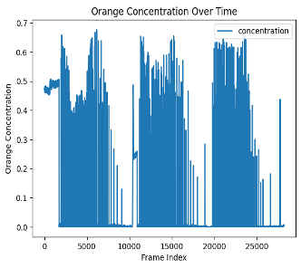

In the methods sections the algorithm for determining the presence of an
orange dot was shown, this algorithm produced a data set that could be
viewed in a plot depicting the concentration detected over time. In
figure [\[fig:concentration\]](#fig:concentration), three sections can clearly be seen.
These sections depict the three experiments run at each of the speed
settings (High, mid, and low speeds). One can also see that the color
concentration seems to dip in the middle for the high and mid. This is
likely due to the fan reaching max speed, and the color saturation
starts to fade away. These sections were split up, and differential
calculus was used to determine the speeds of the fan blades (seen in
figure [19](#fig:speeds)).
The math to find the speeds was calculated as follows:

$$v = \frac{60 * fps}{i_{current} - i_{previous}}$$

Where "v" is the velocity of the blade in rpm, "fps" is the frames per
second of the video (in our case 480 fps), and "i" is the index of the
frame. This converts the frames per second into rpm, which can be
compared with normal rotating machine speeds. The decay time of the
rotation was placed manually on the graphs, but verification of these
times was needed. From the graph, the decay times appear to be 8.8 s,
7.85 s, and 9.5 s for max, mid and low power. However, this is not good
data since these times could not account for an entire rotation before
stopping. The decay times were found in an alternative method using a
stopwatch to find the actual decay times. These results will be
discussed in the coast down results of this paper.

From our graphs we can see that the three speeds the fan runs at is
roughly 1025 rpm, 825 rpm, and 625 rpm. The majority of our calculations
we will be using the maximum speed (1025 rpm) for our results. These
speeds match what is seen in other box fan brands such as [this Amazon
product](https://www.amazon.com/Comfort-CZ200ABK-Full-Force-Circulation-Conditioner/dp/B07T9223ZQ)
and [this Air King
product](https://www.airkinglimited.com/product/commercial-box-fans/),
which both show a range between 800 - 1250 rpm.


The speed of the inertial matched disk was also found using the same
technique as before. Since the disk seems to reach a steady-state speed
higher than the fan blade, the resolution of the algorithm starts to
break down, this can be seen as the stepping that seems to occur in
figure
[\[fig:diskvelocitydots\]](#fig:diskvelocitydots). To mitigate this, the speed was run
through a smoothing function (window average of size 30). The peak
steady-state velocity was recovered as roughly 1715 rpm. Only the max
speed was done for the disk since the coast-down times were so
inconsistent--see section:
[4.4](#sect:coast-down-results).


## Simulating Bearing Friction using Sommerfeld relations 

The shaft has a diameter of $9.54\, mm$. The journal surface diameter
was measured to be around $9.60\, mm$. So the estimated clearance is
about $0.06\, mm$. The mass of the load will be the fan blades, shaft
and rotor which add to be about:
$$m_{load} = m_{rotor shaft} + m_{fan blades} = 180.6 g + 178.1 g = 358.7 g$$
The lubricant is assumed to be VG10 oil with absolute viscosity of 10 cP
at $40^\circ C$. There is likely heat generated during operation and
$40^\circ C$ seems reasonable to assume the fan is running at. This
converts to about $0.01 Pa \cdot s$.

The speed of the fan will be the max speed of 1025 rpms which was
calculated in section 6 and can be seen in Figure
[\[fig:concentration\]](#fig:concentration). To be used in the Summerfeld equation
the speed must be easily converted to $rev/s$. This is done easily:
$$\omega = 1025 rpm / 60 s = 17.083 rev/s$$ The pressure can be
estimated using the mass we calculated earlier and using the projected
area we get: $$p_a = \frac{W}{2 R l}$$ The $m_{load}$ is divided by two
because there are two bearings. Where $W$ is:
$$W = m_{load} * a_g = (358.7/ 2 / 1000) kg * 9.81 m/s = 1.7594 N$$ The
radius ($R$) is the diameter of the shaft
($D = 9.54\, mm/2 = 4.77\, mm$) and the length is 10 mm so the l is
0.010 m. So the applied pressure is:
$$p_a = \frac{1.7594 N}{2 * 0.00477m * 0.010 m} = 18442.3\, Pa$$

So the Summerfeld number can be calculated using this equation:
$$S = \left(\frac{R}{c}\right)^2 \frac{\eta \omega}{p_a}$$
$$S = \left(\frac{4.77\, mm}{0.06\, mm}\right)^2 \frac{0.01 Pa \cdot s * 17.083 rev/s}{18442.3\, Pa}  = 0.058544$$

The Summerfeld charts also require an $l/(2R)$ number which in our case
would be: $$l/(2R) = 10 mm / (2 * 4.77\, mm) = 1.048$$

From the Summerfeld chart in the book the estimated minimum film
thickness would be about: $$h_o/c = 0.233$$
$$h_o = c * 0.233  = 0.06 * 0.233 = 0.01398 mm$$

Then our viscous friction coefficient is estimated to be about:
$$f_v(R/c) = 2$$ $$f_v = 2 * (c/R) = 2 * (0.06 / 4.77) = 0.0255$$

Using the numbers found with the Summerfeld calculations previously, we
can get the $T_f$ on the fan blades:

First, the viscous friction torque is: $$T_f = f_v \cdot W \cdot R$$
Where $f_v$ is the viscous friction, W is the load, and R is the shaft
radius. Plugging in what we know:
$$T_f = 0.0255 \cdot 1.7594 N \cdot (0.00477) m = 0.000214\,N \cdot m$$

This torque is very light, so another modeling approach will be
conducted to compare the Torque this method produced with a method that
assumes the load is negligible.

## Simulating Bearing Friction using Couette Flow Torque 

For our Journal bearings we can compare the previous calculation of
Torque based on the Summerfeld equations with an approximation from the
Couette Flow Torque model. An engineering fluids textbook \[Fundamentals
of Fluids Mechanics, Bruce R. Munson - 7th Edition\] defines the shear
stress resisting the rotation of a shaft for a simple journal bearing.
Since our \"load\" on our bearing is very small, for these equations we
will assume that our fan journal bearings are unloaded. This also
assumes that the gap is much smaller than the inner radius (i.e.,
$r_o - r_i \llless r_i$). The equation for the shear stress is:
$$\tau = \frac{\eta r_i \omega}{r_o - r_i}$$ The torque on the shaft can
be derived simply by using the surface area:
$$T = \tau \cdot A \cdot r_i$$ The surface area is simply:
$A = 2 \pi r_i L$ so the final equation for torque is:
$$T = \frac{\eta r_i \omega}{r_o - r_i} \cdot 2 \pi r_i L \cdot r_i$$
Simplifying and adding our already calculated clearance, $c$:
$$T = 2 \pi L \frac{r_i^3 \eta \omega}{c}$$ Thus,
$$T = 2 \pi L \frac{r_i^3 \eta \omega}{c} = 2 \pi 10\,mm \frac{(9.54\, mm)^3 \cdot 0.01 Pa \cdot s \cdot 17.083 rev/s}{0.06\, mm} =$$
$$T = 2 \pi \cdot 10\cdot 10^{-3}\,m \frac{(9.54\cdot 10^{-3}\,m)^3 \cdot 0.01 Pa \cdot s \cdot 17.083 \cdot 2 \pi \cdot rad/s}{0.06\cdot 10^{-3}\, m}$$
$$T = 1.553e^{-4}\,N \cdot m = 0.0001553\,N \cdot m$$

The Summerfeld model Torque was $0.000214\,N \cdot m$ which is not far
off from this model's calculations. This difference makes sense, since
the Couette model assumes no applied load. The torque difference is
$(0.000214 - 0.0001553)\,N \cdot m = 0.00005870\,N \cdot m$, which is
only a 27.43% deviation from the Summerfeld model.

The 27% difference in Torque suggests that for low load conditions the
shear-based models may provide a reasonable estimation of bearing
friction. This shows that the friction in low-loaded settings is for the
most part from viscous drag in the oil film around the journal, not from
pressure effects. Conversely, in heavily loaded applications the drag
can be ignored because the pressure would squeeze the lubricant film
into the thin film region causing most of the friction to come from
there (thereby allowing the drag to be ignored). Applying this to our
coast-down results, we expect the fan blades to experience friction
primarily from air drag and viscous torque. In contrast, our designed
disk, which carries a higher load, would exhibit friction due to
pressure effects within the bearing, but will likely be less because the
air drag should have a greater effect.

## Coast Down Results 

Using the method described in [Section](#sect:coast-down-method) 3.2.3,
the data was collected and is shown in the table below (table
[2](#tab:coast_down_results)).

      Iteration      Disk - Max   Disk - Mid   Disk - Min   Fan - Max   Fan - Mid   Fan - Min
  ----------------- ------------ ------------ ------------ ----------- ----------- -----------
          1            46.09        47.06        46.39        13.77       13.51       13.16
          2            42.56        44.06         44.8        15.34       14.93       13.88
          3            48.48        54.26        55.39        14.33       14.73       14.69
          4            49.42        53.52        55.52        15.05       14.75       14.48
          5            53.65        55.52        55.65        15.95       14.83       14.79
       Average         48.04        50.884       51.55       14.888       14.55       14.2
   Average of Test       \-         50.158         \-          \-        14.546        \-

  : Coast-Down Testing Results in seconds

The most successful part of these results is the fact that the disk and
the fan have such distinctive coast-down times. The inertia of the disk
caused most of the coast-down times to be around 50 seconds, while the
fan blades only took about 15 seconds. However, due to a few errors, the
coast-down times at each speed for the disk were indistinguishable from
each other. This is likely due to multiple factors such as the fact that
the design of the disk was not mass-matched to the fan, this could (and
did) cause wobble and misalignment of the coils to the rotor. Usually,
motors have a self aligning mechanic due to magnetic fields produced by
the coils.

To mitigate the error produced above, the average of the three tests
will be chosen for acceleration and torque calculations. To begin the
calculations the equations from the introduction will be used to
calculate acceleration and thus torque for each scenario.

First, the coast-down for the fan is addressed analytically. The
acceleration for the fan blades can be calculated as follows:
$$\alpha = \frac{\omega_f - \omega_0}{t} = \frac{0 - 17.083 \cdot 2 \pi \cdot rad/s}{14.546\,s} = -7.3790 rad/s^2$$
Then the torque can be directly calculated from:
$$T = - I \alpha = - 0.005745 kg \cdot m^2 \cdot -7.3790 rad/s^2 = 0.042392\, N \cdot m$$
This is a lot higher than our predicted values from the Summerfeld and
Couette Models which were $0.000214\,N \cdot m$ and
$0.0001553\,N \cdot m$, respectively. To be fair our analytical model
does not account for non-linearity in our calculations. This will be
addressed later. For observations, friction can be calculated:
$$f_{v,air} = \frac{T_f}{W \cdot R} = \frac{0.042392\, N \dot m}{/1000 kg \cdot 9.81\,m/s \cdot 9.54\cdot 10^{-3}\,m} = 0.335531$$
Which seems like a reasonable estimation for viscous friction and air
resistance. And lastly (for our fan blades), the power is calculated:
$$P = T \cdot \omega = 0.042392\, N \cdot m \cdot 17.083 \cdot 2 \pi \cdot rad/s = 4.5502\,Watt$$
Which is small but expected (Watt is used to not be confused with load,
W). Our electrical power is about $96\,Watt$ which roughly converts to
about (assuming 85% motor efficiency) $81.6\,Watt$. Which means for our
fan blades the air resistance and friction consume about
$100\cdot 4.5502\,Watt/81.6 \,Watt = 5.58 \%$ of the mechanical power.

Now let's examine the disk and see if we can roughly derive friction
power. First calculate $\alpha$ (using velocity found from frame
counting algorithm):

$$\alpha = \frac{\omega_f - \omega_0}{t} = \frac{0 - 1715rpm/60s \cdot 2 \pi \cdot rad/s}{50.158\,s} =' -3.5806 rad/s^2$$
This can then be combined with the MOI of the disk (using the corrected
value from the CAD model):
$$T = - I \alpha = - 0.006291 kg \cdot m^2 \cdot -3.5806 rad/s^2 = 0.022526\, N \cdot m$$
The torque is unsurprisingly less than the fan. The expectation is for
the torque to be less since air drag is not a factor in the coast-down
test. This torque can be converted to friction for observations:
$$f_v = \frac{T_f}{W \cdot R} = \frac{0.022526\, N \cdot m}{1350/1000 kg \cdot 9.81\,m/s \cdot 9.54\cdot 10^{-3}\,m} = 0.178292$$
Which shows a friction closer to what the Summerfeld model predicted
compared to the fan ($f_{v,Summerfeld} = 0.0255$). And power:
$$P = T \cdot \omega = 0.022526\, N \cdot m \cdot 1715rpm/60s \cdot 2 \pi \cdot rad/s = 4.0455\,Watt$$
This power has potential to describe the energy consumed due to the
friction in the bearings. Using the same process as before we can see
how much as a percentage it is consuming:
$100\cdot 4.0455\,Watt/81.6 \,Watt = 4.96 \%$

This equates the power the air consumes to slow the bearings down to be
roughly: $$P_{air} = 4.5502\,Watt - 4.0455\,Watt = 0.5047\,Watt$$ This
is much larger than expected for the journal bearings to be consuming.
To get a better picture of what is happening here, the next section
depicts a graphical analysis of the coast-down tests with fitted curves.

## Graphical Coast-Down Calculations

To verify the calculations in the previous section a graphical approach
will be conducted in this section. In summary, the results are agreeable
with our analytical modeling. The function for the disk velocity data
was easily determined because it is linear. The function for the fan
velocity data was fit to be a decreasing logarithmic function. The
graphs for each graphical calculation is on the next page and the code
for each function is listed in the appendix.

Firstly, at the top of the figure
[\[fig:FanGraph\]](#fig:FanGraph), the decay functions for both the fan and the
disk are displayed alongside the data collected from the computer vision
program using the slow motion video. The fan speed curve fit was
relatively successful. The blue dots scattered on the plot are the
velocity data points recovered from the slow-motion video. The curve fit
for the logarithmic decay plot looks like this:

$$\omega(t) = \omega_i e^{-\frac{\ln\left(\frac{\omega_f}{\omega_i}\right)}{t_{\text{fan}}}\cdot t}$$

The average of the acceleration data and the torque both seem to match
what was analytically calculated except for the disk. The acceleration
for the fan decreases quickly at first, then slowly in an exponential
fashion, this is because the air resistance slowly drops as the speed of
the fan drops. This is due to the loss in drag force as the velocity
decreases (e.g. $F_d = 0.5 \cdot \rho \cdot C_d \cdot A \cdot v^2$).
This is also seen in the power profile. Power is higher at the beginning
dropping to a lower state earlier than the torque.

The disk is very straight forward. The decline in speed on is linear,
which means the acceleration is constant throughout the drop in speed.
This means that the force induced by the bearings is primarily due to
friction and because the load is so high the friction is likely asperity
contact. If we were to calculate the Sommerfeld number for the disk we
would start with calculating the pressure: $$p_a = \frac{W}{2 R l}$$ The
$m_{load}$ is divided by two because there are two bearings. Where $W$
is:
$$W = m_{load} * a_g = ((180.6 + 1350)/ 2 / 1000) kg * 9.81 m/s = 7.507593 N$$
The radius ($R$) is the diameter of the shaft
($D = 9.54\, mm/2 = 4.77\, mm$) and the length is 10 mm so the l is
0.010 m. So the applied pressure is:
$$p_a = \frac{7.507593 N}{2 * 0.00477m * 0.010 m} = 78695.94\, Pa$$ The
speed for the Summerfeld number should be in $rev/s$ so:
$$\omega = 1715 rpm / 60 s = 28.58 rev/s$$

So the Summerfeld number can be calculated using this equation:
$$S = \left(\frac{R}{c}\right)^2 \frac{\eta \omega}{p_a}$$
$$S = \left(\frac{4.77\, mm}{0.06\, mm}\right)^2 \frac{0.01 Pa \cdot s * 28.58 rev/s}{78695.94\, Pa}  = 0.022953$$
Which is much lower than what we got for the fan blades in section
[4.2](#sect:sommerfeld) of 0.058544. This leaves us with an
$h_0/c = 0.05$ which means the minimum film thickness is
$h_0 = 0.05 * 0.06 mm = 0.003 mm$ and the viscous friction coefficient
is $f_v(R/c) = 1.1$ which means the $f_v = 1.1 (0.06/4.77) = 0.31482$
And the torque is:
$$T_f = f_v \cdot W \cdot R = 0.31482 \cdot 7.507593 N \cdot 0.00477 m = 0.01127 N\cdot m$$
Which is much closer to the torque results obtained from the velocity
graph of the Disk. Since we know that the disk is slowing down because
of friction in the bearings, we can directly estimate the power from the
Sommerfeld torque as well.
$$P = T \cdot \omega = 0.01127 N\cdot m \cdot 28.58 \cdot 2 \pi\, rad/s = 2.025 Watts$$
Which is very close to the average found on the Power of Disk graph in
figure [23](#fig:DiskGraph).

It's interesting to see the different relationships that both graphs
predict. For example, while the acceleration for the fan increases (that
is, goes to zero), the acceleration of the disk stays constant, the
slower the speed drops. This is directly related to the predicted
torque, for example, the torque of the fan drops as the speed drops,
this can be explained by our unloaded Couette
([4.3](#sect:Couette))
model that we had earlier in combination with the air drag force. The
lower the speed, the less the fluid is producing torque and the less the
air drag is producing torque. While it is completely different for the
disk. While speed drops, the primary method of slowing down for the disk
is friction in the bearings. This raises a suspicion that because of the
evidence put forth, the bearings may be operating in the boundary
lubrication regime while the disk is attached--but this is not confirmed
at least to the knowledge of this author. This may also be why the
torque doesn't change as the speed decreases for the disk. It is
interesting to note the relationship between the disk torque and power.
Due to the function chosen to represent the speed, the power is at its
peak when the speed is at its highest, which would be when the test
started (or when the motor was at its steady-state speed). All in all
here is a comparison of the values predicted by each method:

            \-            Sommerfeld F   Couette F     Linear F     Linear D   Graph F   Graph D   Sommerfeld D
  ---------------------- -------------- ----------- -------------- ---------- --------- --------- --------------
   $\alpha\, (rad/s^2)$        \-           \-           -7.4         -3.6      -7.5      -3.1          \-
    $T\, (N \cdot m)$       0.000214     0.0001553      0.0424       0.0225    0.0431    0.0197       0.0113
          $f_v$              0.0255         \-       0.336 (+air)    0.178       \-        \-         0.315
       $P\, (Watt)$            \-           \-           4.55         4.05      2.39      1.77        2.025

  : Comparison Table, F-Fan, D-Disk (Graph results show average of
  curve)

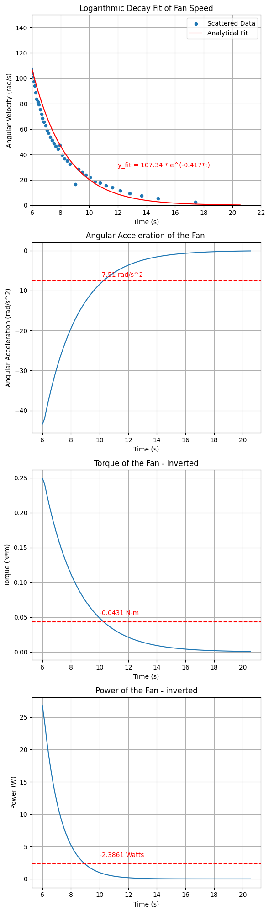

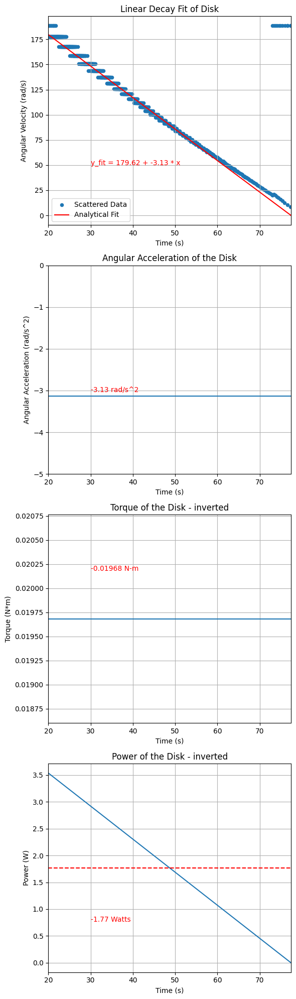

# Conclusion

To conclude, this Graduate Tribology I Course Project successfully
determined that the amount of power consumed by the bearings in the
Galaxy Box fan to be around 2 Watts (depending on the method). This
accounts for around 1-2% of the total power consumed during operation
and therefore these bearings are optimized for the application. They are
cheap, and can last a very long time. This is because the load is so
low, the bearings almost always operate in the full film regime with
only start and stop sequences causing major friction. We discovered
through Sommerfeld and Couette models that the primary method of
friction in the bearings is viscous friction. A coast-down test was
successfully conducted to discover the power loss due to the bearings. A
rotating disk was designed and manufactured using weights (modeling 4
pendulums) and a 3d printed frame. The coast-down tests revealed very
distinct slowing down techniques. With the primary mode of the fan
blades being viscous friction and air drag and for the disk, high
pressure regions and likely lower Stribeck curve performance. The
slowdown tests are what led to the calculations of the power loss due to
friction in the bearings. And a graphical analysis produced by a custom
computer vision program written to obtain speed from slow motion video
was utilized to verify the findings.

There were limitations to this study that prevented further exploration.
Firstly, typical coast-down tests attempt to inertial match and mass
match the fan blades. Since our fan blades were large, it was difficult
to mass match because an optimal manufacturing method was not chosen for
that application (3d printing restricts size). Second, an in-depth
electrical motor analysis is missing from this study. This would reveal
the amount of mechanical energy produced by the motor which could
provide more accurate representations instead of estimations. Thirdly,
while the computer vision program was a convenient and unique method for
obtaining estimations of the speed, it is imperfect and lacks a solid
method for obtaining a final time, and the program seemed to struggle
with the disk (likely due to the disk wobble and other factors like
possible Nyquist frequency interference). There were also many other
angles that were not attempted in this experiment. There were ideas to
run the coast down test in a vacuum. This would eliminate the need for a
disk model. There wasn't any vibration or acoustic emissions' analysis
that could have made it interesting. No microscopy was performed to
analyze wear, and it was difficult to identify the journal bearing
model/manufacturer itself. There were also a few things that lacked
scientific backing that could have made this research/project publish
worthy, like novelty, literature review, and some measurements were done
on household measurement devices.

Despite these limitations, the study was insightful, engaging, and an
enjoyable exploration into bearing friction behavior---demonstrating how
a blend of modeling, hands-on testing, and creative analysis can reveal
meaningful performance metrics in everyday devices.

# Appendix

## A. Code for collecting frames of orange concentration

``` {.python language="Python" caption=""}
import cv2
    import numpy as np
    import matplotlib.pyplot as plt
     
    video_path = "GalaxyFan_480fps.mp4"
    cap = cv2.VideoCapture(video_path)
    # Create a dictionary to store the orange 
    # concentration for each frame
    frame_orange_concentration =       
     
    # Define the lower and upper bounds for the color 
    # in HSV
    hsv_lower_orange = np.array([8, 50, 180])
    hsv_upper_orange = np.array([15, 255, 255])
     
    frame_index = 0
     
    while cap.isOpened():
        ret, frame = cap.read()
        if not ret:
            break
        frame = frame[100:300, 525:700]
        frame = cv2.cvtColor(frame, cv2.COLOR_BGR2RGB)
     
        # Convert the frame to HSV
        hsv_frame = cv2.cvtColor(frame, 
                                cv2.COLOR_RGB2HSV)
     
        # Create a mask using the HSV bounds
        mask = cv2.inRange(hsv_frame, 
                           hsv_lower_orange, 
                           hsv_upper_orange)
     
        zeros = len(mask[mask == 0])
        oranges = len(mask[mask != 0])
     
        frame_orange_concentration[frame_index] = {
            "concentration":oranges / mask.size}
        
        frame_index += 1    
```

## B. Code for calculating speed

``` {.python language="Python" caption=""}
# Obtain df from previous code in appendix section A.
        df_max_speeds = dict()
        fps = 480
        prev = 0
        index = 0
        for percent in df['concentration']:
            if percent > 0.05:
                df_max_speeds[index] = {'time': index / fps, 'concentration': percent, 'speed': 60*fps/(index - prev)}
                prev = index
            index += 1
        df_max_speeds = pd.DataFrame(df_max_speeds).T
        # df_max_speeds can then be used to generate graphs
```

## C. Code for FFT of Motor and Fan Noise

``` {.python language="Python" caption=""}
# Create a figure with 4 subplots
        fig, axs = plt.subplots(5, 1, figsize=(12, 10), sharex=True)
        
        # Titles for each subplot
        titles = [
            "Frequency Spectrum of Max Speed fan with Air Sounds",
            "Frequency Spectrum of Max Speed disk with Air Sounds (not covering holes)",
            "Frequency Spectrum of Max Speed disk Sounds (covering holes)",
            "Frequency Spectrum of Mid Speed disk Sounds (covering holes)",
            "Frequency Spectrum of Low Speed disk Sounds (covering holes)"
        ]
        
        # Video paths corresponding to each FFT result
        video_paths = [
            "slomo/Fan_Together_Again.mp4",
            "slomo/Max_Speed_Air_Sounds.mp4",
            "slomo/Max_Speed_Sounds.mp4",
            "slomo/Mid_Speed_Sounds.mp4",
            "slomo/Low_Speed_Sounds.mp4"
        ]
        
        # Iterate through each subplot and plot the FFT results
        for i, ax in enumerate(axs):
            # Load the corresponding video and extract audio
            video = VideoFileClip(video_paths[i])
            audio = video.audio
            audio_fps = audio.fps
            audio_data = audio.to_soundarray(fps=audio_fps)
            audio_mono = audio_data.mean(axis=1)  # Convert to mono by averaging channels
        
            # Perform FFT
            fft_result = np.fft.fft(audio_mono)
            frequencies = np.fft.fftfreq(len(fft_result), d=1/audio_fps)
        
            # Plot the frequency spectrum
            ax.plot(frequencies[:len(frequencies)//2], np.abs(fft_result)[:len(fft_result)//2])
            ax.set_title(titles[i])
            ax.set_xlim(0, 4000)  # Limit x-axis to 4 kHz
            ax.set_xlabel("Frequency (Hz)")
            ax.set_ylabel("Amplitude")
        
        # Adjust layout
        plt.tight_layout()
        plt.show()
```

## D. Code for Graphing the Smoothed Coast-Down Plot of the Disk

``` {.python language="Python" caption=""}
# Apply smoothing using a moving average
        window_size = 30  # Adjust the window size as needed
        df_max_speeds_df['smoothed_speed'] = df_max_speeds_df['speed'].rolling(window=window_size, center=True).mean()
        
        average = np.average(df_max_speeds_df['smoothed_speed'].dropna())
        
        # Plotting smoothed speed
        df_max_speeds_df.plot('time', 'smoothed_speed', legend=True)
        plt.xlabel('Time (s)')
        plt.ylabel('Speed (rpm)')
        plt.axhline(y=average, color='r', linestyle='--')
        #label the average
        plt.text(0.5, average + 50, f'Average: {average:.2f} rpm', color='r')
        plt.title('Disk Speed (Max Power) Over Time (Smoothed)')
        plt.show()
```

## E. Code for Graphical Coast-Down Analysis of Fan

``` {.python language="Python" caption=""}
from math import *
        import numpy as np
        omega_f = 0.25 #rad/s
        omega_i = 17.083 * 2 * np.pi    #rad/s
        t_fan = 14.546 #s
        I_fan = 0.005745   #kg*m^2
        W_fan = 1.7594 #N
        R = 9.54e-3 #m

        lamb = -np.log(omega_f / omega_i) / t_fan
        A = omega_i
        t = np.linspace(0, t_fan, 100)
        omega_fit = A * np.exp(-lamb * t)

        # Plot acceleration of the omega_fit on second subplot
        acceleration = np.gradient(omega_fit, t)
        avg_acceleration = np.average(acceleration)

        # Plot torque on third subplot
        torque = I_fan * acceleration
        avg_torque = np.average(torque)

        # Calculate and plot power on fourth subplot
        power = torque * omega_fit
        avg_power = np.average(power)

        #Plotting not included to save space
```

## F. Code for Graphical Coast-Down Analysis of Disk

``` {.python language="Python" caption=""}
from math import *
        omega_f = 0 #rad/s
        omega_i = 17.083 * 2 * np.pi    #rad/s
        omega_i_disk = 2 * np.pi * 1537/60    #rad/s
        t_disk = 50.158 #s
        I_fan = 0.005745   #kg*m^2
        I_disk = 0.006291   #kg*m^2
        W_fan = 1.7594 #N
        W_disk = 9.81*1350/1000 #N
        
        R = 9.54e-3 #m
        
        end_time = 77.41
        start_time = 20
        
        t = np.linspace(start_time, end_time, 1000)
        def linear_decay(t, A, B):
            return A + B*t
        
        y_f = 0
        y_0 = 1715.29 * 2 * np.pi / 60
        x_f = end_time
        x_0 = start_time
        
        A = y_0
        B = (y_f - y_0) / (x_f - x_0)
        y_fit = linear_decay(t-start_time, A = A, B = B)
        
        #next plot the acceleration of the omega_fit
        acceleration = np.gradient(y_fit, t)
        avg_acceleration = np.average(acceleration)
        acceleration = np.array([avg_acceleration for _ in range(len(t))])
        
        #now plot the torque
        torque = I_disk * acceleration
        avg_torque = np.average(torque)
        
        #calculate the power
        power = torque * y_fit
        avg_power = np.average(power)

        # Plotting not included to save space
```
